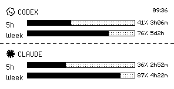

# quote0-burnout

MindReset Quote/0 墨水屏 AI 用量仪表盘 — OpenAI Codex + Claude。

[English](README_EN.md)




## 效果

```
                        16:40
◆ CODEX
5h  [████████████░░░░░] 89%  4h41m
Week [████████░░░░░░░░] 69%  5d23h
─ ─ ─ ─ ─ ─ ─ ─ ─ ─ ─ ─ ─ ─
◆ CLAUDE
5h  [████████████░░░░░] 42%  2h13m
Week [████████░░░░░░░░] 61%  3d4h
```

- **Codex / Claude**：同尺寸双行面板（5h / Week），内联点阵进度条，显示余量百分比 + 重置倒计时
- **图标**：Codex 和 Claude 都使用 16×16 单色 PNG；Claude 来自 Claude symbol 的墨水屏二值化版本
- **字体**：PixelOperator 16px / Minecraftia 8px
- Codex 数据直连 OpenAI OAuth API，**无需 CLI 依赖**
- Claude 数据参考 CodexBar 的 Claude Code OAuth usage API；token 会从环境变量、`~/.claude/.credentials.json` 或 macOS Keychain 读取，最后 fallback 到 `claude /usage`

> 完整的设计规范、API 参考、渲染细节见 [`skill/`](skill/) 目录。

## 安装

```bash
pip install -r requirements.txt
# 确保 codex CLI 已登录（仅首次）：
codex
```

## 配置

```bash
cp config.example.env .env
# 编辑 .env 填入密钥
```

| 变量 | 必须 | 说明 |
|------|------|------|
| `QUOTE0_API_KEY` | ✓ | Quote/0 API key |
| `QUOTE0_DEVICE_ID` | ✓ | 设备 ID |
| `CODEX_ACCESS_TOKEN` | | 覆盖 Codex token（默认读 ~/.codex/auth.json） |
| `CLAUDE_ACCESS_TOKEN` | | 覆盖 Claude token（默认读 ~/.claude/.credentials.json 或 macOS Keychain；缺失时 fallback 到 `claude /usage`） |

## 使用

```bash
python display.py --preview   # 本地预览
python display.py             # 推送到设备
python display.py --check     # 自检
```

## 定时任务

```bash
# macOS launchd（每 5 分钟）
cp scripts/com.ajax.quote0-burnout.plist.example ~/Library/LaunchAgents/
# 编辑 plist 里的路径，然后：
launchctl load ~/Library/LaunchAgents/com.ajax.quote0-burnout.plist
```

## 故障排查

```bash
python display.py --check     # 检查所有环节
```

- **Codex 显示 "no auth"** — 运行 `codex` 重新认证
- **Claude 显示 "no auth"** — 运行 `claude` 重新认证，确认 macOS Keychain 可访问，或设置 `CLAUDE_ACCESS_TOKEN`
- **推送 404** — Dot. App 里删掉 IMAGE_API 卡片重新添加
- **定时不更新** — `launchctl kickstart gui/$(id -u)/com.ajax.quote0-burnout`

## 技能文件

本项目附带 [skill/SKILL.md](skill/SKILL.md)，符合 Vercel Skills 标准，可直接导入 Hermes Agent 使用。
