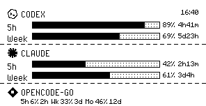
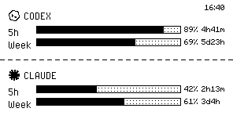
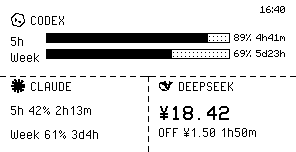
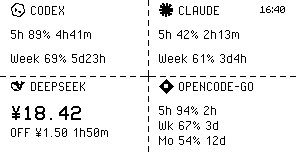

# quote0-burnout

AI usage dashboard for MindReset Quote/0 e-ink display — OpenAI Codex + Claude + DeepSeek + OpenCode Go, rendered at 296×152 in 1-bit B&W and pushed to the device.

[中文](README.md)


## Layouts

`auto` (default) fits the number of working providers; `--layout` / `LAYOUT` pins one:

| `stack` full-width stack | `1+1` two halves | `1+2` half + 2 quarters | `2+2` four cells |
|---|---|---|---|
|  |  |  |  |

> Full spec — cell contracts, seams, fonts, panel ordering, the cached `*` marker — in [docs/layouts.md](docs/layouts.md).

## Features

- **Codex / Claude**: matched dual-row panels (5h / Week) with dot-grid bars, remaining% + reset countdown
- **DeepSeek**: big balance + peak/off-peak billing tier (PEAK/OFF, official rate card 2026-08; off-peak = 50% of peak) + countdown to the next tier switch
- **OpenCode Go**: Zen "Go" subscription usage (5h / Wk / Mo)
- **Ordering**: the provider whose data changed most recently gets the most visible slot; providers failing auth/timeout are hidden
- **Cache fallback**: when the Codex API is down the last snapshot is served, marked `16:40*` (`*` = cached)
- **Pixel fonts**: PixelOperator 16px / Minecraftia 8px / VCR OSD 21px, all native sizes — scaling a pixel font destroys the glyphs
- **No CLI dependency**: Codex talks to the OpenAI OAuth API directly; Claude uses CodexBar's Claude Code OAuth usage API

## Install

```bash
pip install -r requirements.txt
# codex CLI for one-time auth: codex
```

## Configure

```bash
cp config.example.env .env
```

| Variable | Required | Description |
|----------|----------|-------------|
| `QUOTE0_API_KEY` | ✓ | Quote/0 API key |
| `QUOTE0_DEVICE_ID` | ✓ | Device ID |
| `CODEX_ACCESS_TOKEN` | | Override Codex token (default: `~/.codex/auth.json`) |
| `CLAUDE_ACCESS_TOKEN` | | Override Claude token (default: `~/.claude/.credentials.json` or macOS Keychain; fallback: `claude /usage`) |
| `DEEPSEEK_API_KEY` | | DeepSeek balance + rate card (`DEEPSEEK_MODEL` picks the pricing model) |
| `OPENCODE_GO_API_KEY` | | OpenCode Zen usage API |
| `AGY_API_KEY` | | Google AGY (Antigravity) quota API key |
| `LAYOUT` | | `auto` (default) / `stack` / `1+1` / `1+2` / `2+2` |
| `REFRESH_INTERVAL` | | self-scheduling loop interval (e.g. `60`, `5m`, `1h`; min 60s) |

## Usage

```bash
python display.py --preview    # local preview PNG (no push)
python display.py              # push to device
python display.py --interval 5m # self-scheduling loop (pushes every 5m, min 60s)
python display.py --layout 2+2 # pin a layout (overrides LAYOUT env)
python display.py --text       # Text API
python display.py --debug-json # print snapshot JSON
python display.py --check      # self-check
python display.py --list-tasks # list task slots
```

## Scheduling (macOS launchd, every 5 min)

```bash
cp com.ajax.quote0-burnout.plist.example ~/Library/LaunchAgents/
# edit the Program path, then:
launchctl load ~/Library/LaunchAgents/com.ajax.quote0-burnout.plist
```

## Troubleshooting

- **Codex / Claude "no auth"** — run `codex` / `claude` to re-authenticate
- **Push 404** — delete and re-add the IMAGE_API card in Dot. App Content Studio
- **Schedule not updating** — `launchctl kickstart gui/$(id -u)/com.ajax.quote0-burnout`

## Development & Contributing

- Contributing Guide & Provider Contract: [CONTRIBUTING.md](CONTRIBUTING.md)
- `providers/`: provider implementations (fetch → snapshot → text)
- `render.py`: layout engine + rendering; `scripts/render_layout_gallery.py` regenerates preview images
- Testing: `python3 -m pytest`
- Pixel-level design spec: [skill/references/eink-design.md](skill/references/eink-design.md)
- This repo ships [skill/SKILL.md](skill/SKILL.md) (Vercel Skills standard) — drop it into Hermes Agent for AI-assisted development
