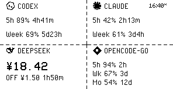

# Layouts — 布局规格

Quote/0 屏幕 **296×152、黑白 1-bit**，由 `render.py` 渲染。布局引擎把屏幕切成 **2 行 × 76px**：
½ 面板 = 整行 296×76；¼ 格 = 148×76。

## 模式

| 模式 | 构成 | 效果图 |
|---|---|---|
| `stack` | 旧版全宽堆叠（`_render_v5`） |  |
| `1+1` | 上下两个堆叠的 ½ 面板 |  |
| `1+2` | 上 ½ + 下两个 ¼ |  |
| `2+2` | 四个 ¼（2×2 网格） |  |

- 默认 **`auto`**：可用 provider 数 ≥4 → 2+2，3 → 1+2，2 → 1+1，≤1 → stack
- `--layout` CLI 或 `LAYOUT` 环境变量固定指定；非法值警告后回退 `auto`

## 格子内容（tier）

### ½ 面板

- **Codex / Claude**：logo + 16px 标题，两行 16px 行（5h / Week）带点阵进度条，行块底部对齐（单行面板与双行面板底边齐平）
- **DeepSeek**：标题行（比其他半屏栏上移 4px）；**hero 行** = VCR 21px 余额（左）+ 档位徽章 `OFF`/`PEAK`（右）；16px 信息行：`1h50m » PEAK`（左，PixelOperator 的 `»` 充当过渡箭头）/ `in ¥1.50 out ¥4.50`（右）
- **OpenCode**：5h / Wk / Mo 三行

### ¼ 格

- 头部与半屏栏同一字面和几何：16px logo + 16px 标题（PixelOperator 原生 16px；右上角时间戳较宽时标题会被裁切预留）
- **Codex / Claude**：两行 16px `标签 剩余% 重置`
- **OpenCode**：三行（5h / Wk / Mo，第三行压缩间距）
- **DeepSeek**：VCR OSD 21px 余额大字 + 16px 档位徽章（`OFF ¥1.50 1h50m`）
- **死掉的 provider 不会出现在网格里**（ok=False → 隐藏，而不是画错误单元格）；显式布局的剩余格留白

## 分隔线

虚线 **6px dash / 4px gap**；交叉处画 **实线 2px 臂**：

- `2+2`：横线 + 竖线，交叉 = 四向 ┼
- `1+2`：横线 + 仅下半行的竖线，交叉 = 无上臂 ┴
- `1+1`：只有一条横线

## 刷新时间

**屏幕右上角一个全局时间**（¼ 格头部与它共享同一行，宽时间戳会预留标题空间）。Codex 缓存兜底时显示 `16:40*`（`*` = 缓存数据）：

## 面板排序

每个 provider 数据一旦变化就打上新时间戳（与上次快照做指纹比对；倒计时/重置时间这类每轮都在跳的字段不计入）。排序规则：

- 数据**最近变化**的 provider 排在最可见的格（左上）
- 无变化时按规范顺序（codex, claude, deepseek, opencode）
- 只在*可用*（ok=True）的 provider 中间排；格子不够时取排在最前的 n 个

## 字体

| 字体 | 尺寸 | 用途 |
|---|---|---|
| PixelOperator | 16px 原生 | 标题与行标签 |
| Minecraftia | 8px 原生 | 时间戳与注释 |
| VCR OSD Mono | 21px 原生 | DeepSeek 余额大字 |

**像素字体禁止缩放** —— 非线性缩放会毁掉字形（试过 12px：句点直接消失）。换字号 = 换字体。所有字体位于 `assets/fonts/`（VCR 在 `assets/fonts/`）。
